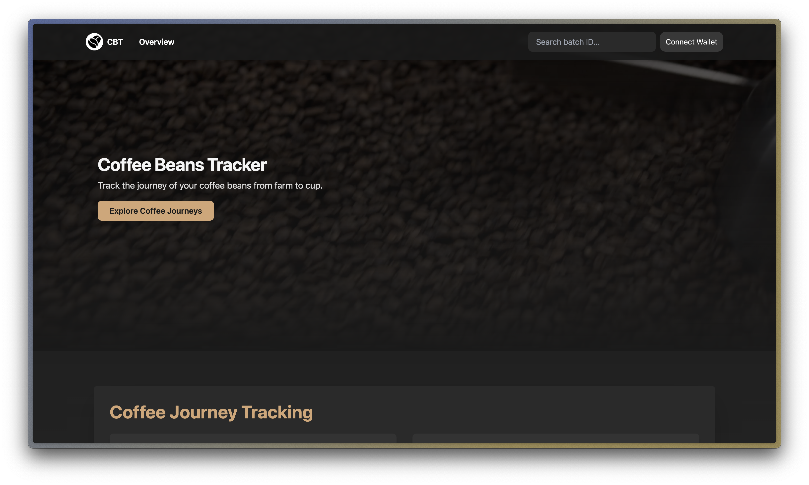

# Coffee Track and Trace App

A Next.js-based application for tracking and tracing coffee, built on the SettleMint platform. This app integrates Web3Auth for secure authentication, features an AI-powered search functionality, and uses the Ethereum Attestation Service (EAS) as its smart contract backend.



## Demo

Check out the live demo of the application: [Coffee Track and Trace Demo](https://coffee-beans-tracker-d780a.gke-europe.settlemint.com/)

## Features

- Coffee tracking and tracing system
- Web3Auth integration for blockchain-based authentication
- AI-powered search feature for efficient data retrieval
- Ethereum Attestation Service (EAS) as the smart contract backend
- Built with Next.js for optimal performance and SEO

## Prerequisites

- [Bun](https://bun.sh/) installed on your system
- SettleMint platform access
- Web3Auth credentials

## Getting Started

1. Clone the repository:
   ```
   git clone https://github.com/your-repo/coffee-track-and-trace.git
   cd coffee-track-and-trace
   ```

2. Install dependencies:
   ```
   bun install
   ```

3. Set up environment variables:
   Copy the `.env.example` file to `.env.local` and fill in the required values:
   ```
   cp .env.example .env.local
   ```

4. Run the development server:
   ```
   bun dev
   ```

5. Open [http://localhost:3000](http://localhost:3000) in your browser to see the application.

## Available Commands

- `bun dev`: Start the local development server
- `bun build`: Build the application for production
- `bun start`: Start the production server
- `bun docker`: Build and push a new Docker image

## Development

You can start editing the app by modifying `src/app/page.tsx`. The page auto-updates as you edit the file.

## Deployment

To deploy the application using Docker:

1. Ensure you have Docker installed and configured on your system.
2. Run the following command to build and push a new Docker image:
   ```
   bun docker
   ```

For more detailed deployment instructions, refer to the project's deployment documentation.

## Learn More

- [Next.js Documentation](https://nextjs.org/docs) - learn about Next.js features and API.
- [SettleMint Platform](https://www.settlemint.com/) - explore the SettleMint blockchain platform.
- [Web3Auth Documentation](https://web3auth.io/docs/) - learn about Web3Auth integration.
- [Bun Documentation](https://bun.sh/docs) - discover more about the Bun JavaScript runtime.
- [Ethereum Attestation Service](https://attest.sh/) - learn about EAS and its capabilities.

## Contributing

Contributions are welcome! Please feel free to submit a Pull Request.

## License

This project is licensed under the [MIT License](LICENSE).
